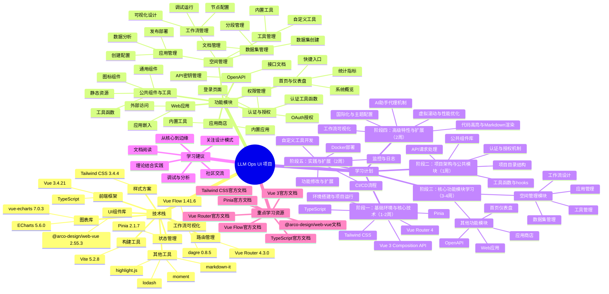

# LLM Ops UI 项目思维导图

## 思维导图使用说明

1. **查看方式**：
   - 使用支持Mermaid的Markdown编辑器打开（如VS Code安装Mermaid插件、Typora、GitLab等）
   - 或复制到Mermaid在线编辑器查看：https://mermaid.live/

2. **结构说明**：
   - 中心节点：项目名称
   - 一级分支：技术栈、功能模块、学习计划、学习建议、重点学习资源
   - 二级分支：各部分的主要内容
   - 三级分支：具体的技术点、功能点或学习内容

3. **学习路径**：
   - 按照学习计划的阶段顺序进行学习
   - 每个阶段先了解相关技术栈，再学习具体功能模块
   - 结合学习建议和重点资源进行深入学习

4. **扩展使用**：
   - 可以根据实际学习进度和需求，调整思维导图的结构和内容
   - 可以在学习过程中添加自己的笔记和理解
   - 可以将思维导图导出为图片，用于学习计划的展示和分享

## 项目核心文件位置

### 认证与授权
- `src/views/auth/` - 登录和授权页面
- `src/utils/auth.ts` - 认证工具函数
- `src/hooks/use-auth.ts` - 认证相关hooks

### 空间管理
- `src/views/space/` - 空间管理页面
- `src/hooks/use-app.ts` - 应用管理hooks
- `src/hooks/use-workflow.ts` - 工作流hooks
- `src/hooks/use-dataset.ts` - 数据集hooks

### 公共组件
- `src/components/` - 通用组件
- `src/components/icons/` - 图标组件

### 工具与服务
- `src/utils/` - 工具函数
- `src/services/` - API服务
- `src/hooks/` - 业务逻辑hooks

## 技术栈学习优先级

1. **必须掌握**：Vue 3、TypeScript、Vue Router、Pinia
2. **重要掌握**：Tailwind CSS、@arco-design/web-vue
3. **了解掌握**：ECharts、Vue Flow、highlight.js
4. **按需学习**：其他工具库根据功能需求学习

通过这份思维导图，你可以清晰地了解项目的整体结构、技术栈和学习路径，帮助你更有条理地进行学习和研究。